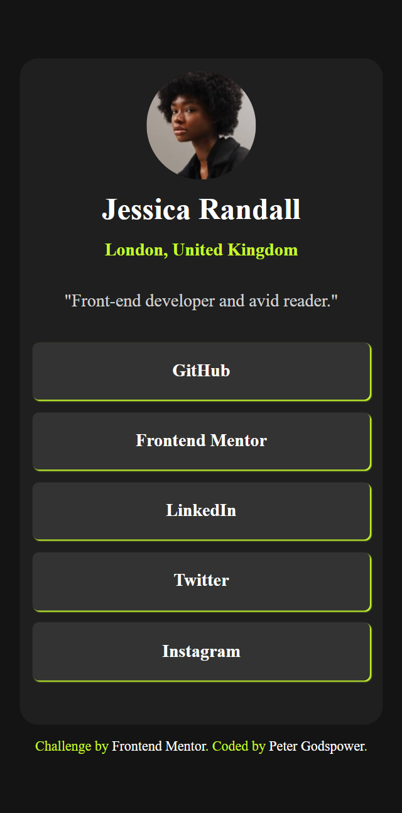

# Frontend Mentor - Social Links Profile Solution

This is a solution to the Social Links Profile challenge on Frontend Mentor. Frontend Mentor challenges help you improve your coding skills by building realistic projects.

## Table of Contents

- [Overview](#overview)
  - [Screenshot](#screenshot)
  - [Links](#links)
- [My Process](#my-process)
  - [Built With](#built-with)
  - [What I Learned](#what-i-learned)
  - [Continued Development](#continued-development)
  - [Useful Resources](#useful-resources)
- [Author](#author)
- [Acknowledgments](#acknowledgments)

## Overview

### Screenshot

.png>)

### Links

- Solution URL: [Frontend Mentor](https://www.frontendmentor.io/solutions)
- Live Site URL: [Live Demo](https://your-live-site-url.com)

## My Process

I approached this project with a focus on creating a responsive and visually appealing social links profile using modern web technologies.

### Built With

- Semantic HTML5 markup
- CSS custom properties
- Flexbox for layout
- Responsive design using `clamp()` and viewport-relative units (vw)
- Google Fonts - Imported "Inter" font for typography styling

### What I Learned

Through this project, I reinforced my knowledge of semantic HTML, CSS layout techniques, and responsive design principles. Specifically:

- How to use `clamp()` for responsive margin and font sizes.
- Implementing CSS variables for consistent theming.
- Enhancing accessibility through semantic HTML elements.

### Continued Development

In future projects, I aim to further refine my skills in:

- Advanced CSS techniques such as CSS Grid for layout.
- JavaScript integration for interactive components.
- Improving accessibility and SEO practices in web development.

### Useful Resources

- [MDN Web Docs](https://developer.mozilla.org/en-US/) - Comprehensive web development resources.
- [CSS-Tricks](https://css-tricks.com/) - Tutorials and articles on modern CSS techniques.
- [Frontend Mentor](https://www.frontendmentor.io/) - Challenges and solutions for practicing frontend skills.

## Author

- Frontend Mentor - [@Peter Godspower](https://www.frontendmentor.io/profile/TheBeyonder616)
- GitHub - [TheBeyonder616](https://github.com/TheBeyonder616)

## Acknowledgments

I would like to acknowledge Frontend Mentor for providing this challenge and the community for its support and feedback.
